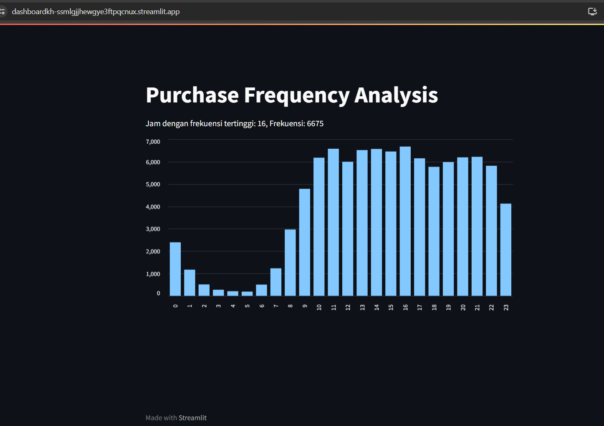

# Proyek Akhir Belajar Analisis Data dengan Python
## Setup environment
```
conda create --name main-ds python=3.9
conda activate main-ds
pip install numpy pandas scipy matplotlib seaborn jupyter streamlit babel
```
## Run steamlit app
```
streamlit run dashboard.py
```

## Tautan untuk Dashboard Streamlit
[dashboard](https://dashboardkh-ssmlgjjhewgye3ftpqcnux.streamlit.app/)

https://dashboardkh-ssmlgjjhewgye3ftpqcnux.streamlit.app/
## Screenshot dashboard
